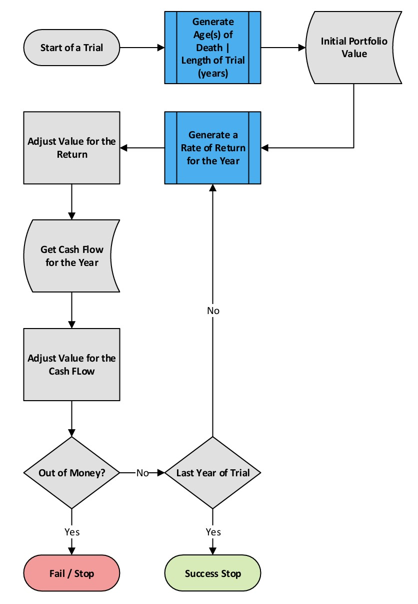

```{r, include = FALSE, echo=FALSE, message=FALSE}
knitr::opts_chunk$set(
  collapse = TRUE,
  comment = "",
  echo = FALSE
)
library(dplyr)
# library(aasim)
devtools::load_all()
library(plotly)
library(knitr)
library(kableExtra)
```
```{r setup}
sim <- simClass(
        description = "Simulation for Rex and Julia",
        nTrials = 1000,
        startValue = 10000000,
        lengthType = "M",
        length = 30,
        seed = 101,
        defaultInflation = 0.025,
        ror = 0.06,
        stdDev = 0.09,
        targetValue = 1,
        targetValueIsReal = TRUE,
        stockWt = 0.6,
        nConsecMonths = 12,
        retAdj = -0.03,
        minDate = getSBIDateRange()$minDate,
        maxDate = getSBIDateRange()$maxDate,
        overrideInflation = TRUE,
        asOfDate = as.Date("2024-10-14"),
        returnGeneratorMethod = "S"
    )
sim <- addPerson.sim(
            sim = sim,
            name = "Rex",
            initials = "RM",
            birthDate = as.Date("1960-07-05"),
            gender = "M",
            retireAge = 65,
            mort.factor = 1,
            mort.adj.years = 3
        )
sim <- addPerson.sim(
            sim = sim,
            name = "Julia",
            initials = "JM",
            birthDate = as.Date("1963-06-20"),
            gender = "F",
            retireAge = 50,
            mort.factor = 1,
            mort.adj.years = 3
        )
sim$cf <- addCF(
                simCF = sim$cf,
                description = "Retirement expenses",
                startType = "yr",
                start = 1,
                endType = "end",
                end = 1,
                type = "w",
                amount = 500000,
                defaultInflationAdj = TRUE,
                inflation = 0
            )
sim$cf <- addCF(
                simCF = sim$cf,
                description = "Social Security",
                startType = "p1age",
                start = 70,
                endType = "2nddeath",
                end = 1,
                type = "c",
                amount = 3500*12,
                defaultInflationAdj = FALSE,
                inflation = 0.02
            )
```
```{r simulate}
sim <- simulateSHC(sim)
```
```{r simHResults}
simResult <- "simH"
simH_SuccessStats <- getSuccessStats(sim, simResult)
simH_DonutChart <- chartSuccessDonut(sim, "T", simResult)
simResult <- "simS"
simS_SuccessStats <- getSuccessStats(sim, simResult)
simS_DonutChart <- chartSuccessDonut(sim, "T", simResult)
simResult <- "simC"
simC_SuccessStats <- getSuccessStats(sim, simResult)
simC_DonutChart <- chartSuccessDonut(sim, "T", simResult)
```
### Overview    
**Will you outlive your money? How long will your savings last?** These are the questions we aim to address, and our unique approach realistically combines investment risk and mortality risk.

Classic financial planning tools assume a fixed age of death (often 95 for conservatism). If you're likely to succeed financially assuming you live to 95, that's great, but it doesn't answer the real question: What are the chances you'll run out of money? Most people don't live to 95, and having enough funds to live to 95 means you may leave money on the table.

Our analysis tests your capital sufficiency by considering a range of possible death ages, weighted by their likelihood. You can still focus on scenarios where you live beyond actuarial expectations. Our tool shows how longevity impacts your success rate.

Our approach differs philosophically, too. Predicting the future—investment returns, inflation, mortality—is inherently uncertain. Future tax rates and other factors add to this unpredictability. Our philosophy accepts and acknowledges this imprecision. Other tools may try to calculate future taxes to the penny, but we criticize this for potentially giving a false sense of precision and requiring more input effort.

Predicting future wealth is like flipping a coin with a 50% chance of heads or tails. Detailing the coin’s weight, toss force, or air resistance doesn't improve prediction accuracy because the randomness outweighs these factors. We believe much time and effort is wasted on certain investment planning details, so we simplify the inputs. This saves time and recognizes the imprecise nature of predictions.

Imagine a coin-flipping calculator with inputs for the coin's weight, toss force, and humidity. It might seem more precise, but it isn’t. Our calculator provides a ballpark estimate.  Consider these results as an initial analysis, like taking your temperature to gauge your health. It's not a thorough analysis, so please read our [disclaimers](#Disclaimers).  

There’s more than one way to simulate portfolio returns. We use three methods: statistical, random historical, and chronological. Given the problem’s nature, multiple approaches allow for a more robust conclusion. These methods are described in detail later.

### How long do you need your money to last?    
Our approach evaluates many possible ages of death and weights the results according to the probability of living to those ages. This helps answer the question: What is the probability your money will outlast you? We conducted `r sim$nTrials` trials, simulating how your portfolio might perform in each scenario.    
* 75% lasted at least `r quantile(sim$simS$lengths, 0.25)` years.    
* 50% lasted at least `r quantile(sim$simS$lengths, 0.50)` years.    
* 25% lasted at least `r quantile(sim$simS$lengths, 0.75)` years.  
The following displays how many trials lasted for how many years. Each of the four colors in the chart represents 25% of the outcomes.    
```{r distTimeChart, out.width='100%', out.height='100%'}
fig = chartDistOfTime(sim, "simS")
htmltools::tagList(
  htmltools::tags$div(style = "text-align: center;", fig))
```

### A Quick Introduction to Trials    
```{r txtRetAdj}
if (sim$retAdj == 0) {
    txtRetAdj <- ""
} else if (sim$retAdj > 0) {
    txtRetAdj <- paste0("We've added ", 100 * sim$retAdj, "% to each year's return because we think future returns are likely to be higher than those in the past. ")
} else {
    txtRetAdj <- paste0("We've subtracted ", 100 * -sim$retAdj, "% from each year's return because we think future returns are likely to be lower than those in the past. ")
}
```
Each of the `r sim$nTrials` trials represents a lifetime (or a couple’s lifetimes). If your funds are enough to meet your goals, the trial counts as a success. If the money runs out, it's a failure. The main metric we look at is the percentage of successful trials.

Every trial begins with the current portfolio value. Each year, this value is adjusted based on the annual rate of return and the net cash flows (contributions minus withdrawals). If the portfolio depletes before the trial ends, it’s a failure. If there's money left, it’s a success. For more details, see the [flowchart](#Flowchart) or the [example](#SingleTrialTable) table.

Here's a quick rundown of the three methods used to generate returns:

* Historical Random: We randomly select `r sim$nConsecMonths` consecutive months of stock, bond, and inflation data from `r format(sim$minDate, "%B %Y")` to `r format(sim$maxDate, "%B %Y")`. `r txtRetAdj` The weighting to stocks is `r 100 * sim$stockWt`%.    
* Statistical Random: Returns are generated using a lognormal distribution with a mean return of `r 100 * sim$ror`% and a standard deviation of `r 100 * sim$stdDev`%.    
* Chronological: This method steps through history starting from `r format(sim$minDate, "%B %Y")`, creating `r sim$simC$nTrials` distinct 30-year periods through `r format(sim$maxDate, "%B %Y")`. No randomness involved here.    

**Comparison of the Returns Generated by the Three Methods:**    
```{r comparisonOfReturns}
dfReturnComparison <- compareRateOfReturns(sim)
kable(dfReturnComparison, format = "html") %>%
    kable_styling(bootstrap_options = c("striped", "hover", "condensed", "responsive"), position = "left")
```

### Summary Success Rates of the Three Methods    
```{r summaryBarChart}
fig = chartSuccessBarComparison(sim, "T" )
htmltools::tagList(
  htmltools::tags$div(style = "text-align: center;", fig))
```

### Return Generating Method 1: Chronological    
This is the simplest method. We step through history starting `r format(sim$minDate, "%B %Y")`, creating `r sim$simC$nTrials` distinct 30-year periods through `r format(sim$maxDate, "%B %Y")`. This creates hypothetical portfolio values without explicit consideration of taxes, fees, expenses and such.  Please read the [disclaimers](#Disclaimers). No randomness involved here. 
```{r simC}
fig = simC_DonutChart
htmltools::tagList(
  htmltools::tags$div(style = "text-align: center;", fig))
simulationReturnStats <- getDistribution(unlist(sim$simC$rateOfReturns), ,isReturnSeries = TRUE)
```
In this simulation, `r prettyNum(simulationReturnStats$nObs, big.mark = ",", scientific = FALSE)` returns were generated.  Across all of the *simulations*, the compound annual return was `r round(simulationReturnStats$geomAvg, 1)`%.  The standard deviation was `r round(simulationReturnStats$sd, 1)`%.  

The Chronological method can provide insight into the environments which lead to better and worse outcomes.   The following chart plots the *portfolio values* of 3 trials: one ending with the lowest value ("Worst"), the median ("Median") value (50% of outcomes are better and 50% are worse), and the highest ("Best") value.  These portfolio values reflect the combination of cash flows and returns.   

```{r ChronoExamples}
simResult <- "simC"
idxVec <- c(Worst = findTrialByQuantile(sim, simResult, 0),
         Median = findTrialByQuantile(sim, simResult, 0.5),
         Best = findTrialByQuantile(sim, simResult, 1))
idxDates <- getDatesOfChronologicalTrial(sim, idxVec)
fig = chartSampleTrialsPortfolioValues(sim, idxVec, TRUE, simResult, FALSE)
htmltools::tagList(
  htmltools::tags$div(style = "text-align: center;", fig))
cat("* The ", names(idxVec)[1], " trial was from ", format(idxDates$startDates[1], "%B %Y"), " through ", format(idxDates$endDates[1], "%B %U"), ". ", sep = "")
cat("* The ", names(idxVec)[2], " trial was from ", format(idxDates$startDates[1], "%B %Y"), " through ", format(idxDates$endDates[2], "%B %U"), ". ", sep = "")
cat("* The ", names(idxVec)[3], " trial was from ", format(idxDates$startDates[1], "%B %Y"), " through ", format(idxDates$endDates[3], "%B %U"), ". ", sep = "")
```

In portfolios experiencing contributions and withdrawals, 'timing' becomes crucial. Portfolios last longer that experience higher returns when wealth is greater and lower returns when wealth is less. Typically, people accumulate wealth during working years and have saved the most at retirement. Then wealth diminishes as funds are withdrawn to support their lifestyle. In this life cycle, the return in the year of retirement has the most significant impact on wealth. It’s better to experience lower returns early when savings are minimal; or, later in life when much of the wealth has already been spent.   

Generally, the worst trial will have a combination of low average returns and experience the worst returns come when the portfolio value is high.  The best trial tends to have high average returns and experiences the best returns occur when the portfolio value is high. The following chart shows how \$1, invested without subsequent cash flows, would have grown in the trials which resulted in the worst, best and median portfolio values. The 
compound average growth rate (CAGR) is displayed in the legend.   

```{r ReturnsWorstMedianBest}
fig = chartGrowth1DollarBestMedianWorst(sim, "simC")
htmltools::tagList(
  htmltools::tags$div(style = "text-align: center;", fig))
```

The following chart illustrates the impact of timing and average return on the final portfolio value.  Each dot represents a single trial. 
The average rate of return is shown on the horizontal axis and the terminal value along the vertical.  Note how the values tend to increase 
as the return increases.  The relationship is not perfect.  Notice how trials with the same return (the points are aligned vertically) have different terminal values - timing is the reason there is a difference.  

```{r chartTVvsAvgRoR}
fig = chartTerminalValuesVsAverageReturns(sim, simResult, FALSE)
htmltools::tagList(
  htmltools::tags$div(style = "text-align: center;", fig))

```
The Chronological method shows the impact of the timing of returns.  Now let's use history and incorporate mortality risk.     

### Return Generating Method 2: Historical Random    
```{r simH}
simH_DonutChart
historicalReturnStats <- getHistoricalReturnStats(sim$stockWt, sim$minDate, sim$maxDate)
simulationReturnStats <- getDistribution(unlist(sim$simH$rateOfReturns), ,isReturnSeries = TRUE)
if (toupper(sim$lengthType) == "M") {
    txtTrialLength <- "The lengths of these trials vary based on mortality risk."
} else {
    txtTrialLength <- paste0("The length of every trial is ", sim$length, " years.")
}

```
`r txtTrialLength`    

Underlying this method are the same U.S. stocks, bonds and inflation data from `r format(sim$minDate, "%B %Y")` through `r format(sim$maxDate, "%B %Y")`as the Chronological method. The computer randomly selects twelve consecutive months and links them together to form returns for a year. For this analysis we also weight the stocks returns by `r 100 * sim$stockWt`% and bonds by `r 100 * (1 - sim$stockWt)`%.  `r txtRetAdj`

Over the *entire history* of the underlying data the compound annual return was 
`r round(100 * historicalReturnStats$portfolio$GeomReturn, 1)`%.  The standard deviation was `r round(100 * historicalReturnStats$portfolio$StdDev, 1)`%.  In the simulation, `r prettyNum(simulationReturnStats$nObs, big.mark = ",", scientific = FALSE)` returns were generated.  Across all of the *simulations*, the compound annual return was `r round(simulationReturnStats$geomAvg, 1)`%.  The standard deviation was `r round(simulationReturnStats$sd, 1)`%.

### Return Generating Method 3: Statistical Random   
```{r simS}
simS_DonutChart
simulationReturnStats <- getDistribution(unlist(sim$simS$rateOfReturns), ,isReturnSeries = TRUE)
impliedGeomMean <- 100 * round(sim$ror - sim$stdDev^2/2, 3)
```
`r txtTrialLength`    

Returns are randomly generated using a lognormal distribution assuming an arithmetic mean return of `r 100 * sim$ror`% and a standard deviation of `r 100 * sim$stdDev`% which will result in a compound annual return of about `r impliedGeomMean`%. 

In this simulation, `r prettyNum(simulationReturnStats$nObs, big.mark = ",", scientific = FALSE)` returns were generated.  Across all of the *simulations*, the compound annual return was `r round(simulationReturnStats$geomAvg, 1)`%.  The standard deviation was `r round(simulationReturnStats$sd, 1)`%.  

### Flowchart of a single Trial {#Flowchart}    
```{r flowchart, out.width='50%', out.height='50%'}
knitr::opts_chunk$set(fig.pos = "H", out.extra = "", fig.align = 'center')

```

### Example of a Single Trial {#SingleTrialTable}     
The following table a single trial using the `r sim[[simResult]]$returnGeneratingMethod` was selected to illustrate the values of a trial.
```{r singleTrial}
simResult <- "simH"
dfExampleTrial <- aasim::makeTrialTable(sim, simResult)
kable(dfExampleTrial, format = "html") %>%
    kable_styling(bootstrap_options = c("striped", "hover", "condensed", "responsive"))
```

### Review of inputs       
```{r ReviewInputs}
print_sim_main(sim)
if (nCF.sim(sim) >= 1) {
    cat("\nCash Flows\n")
    print_sim_cf(sim$cf)
}
if (nPersons.sim(sim) >= 1) {
    cat("\nPersons\n")
    print_sim_persons(sim)
}
```

### Disclaimers {#Disclaimers}    
Nothing in this document should be considered investment advice.    
Past performance is no guarantee of future performance.    
Predicting the future is hard. ("Man plans, God laughs.")     
These are estimates.        
Garbage in, garbage out.
We don't assume responsibility for mistakes, miscalculations etc.. Everyone is fallible.    
Where we discuss the generation of random numbers, we acknowledge that they are pseudo-random and not truly random. We cannot imagine that this makes a meaningful difference in the result. If this bothers you, we advise therapy.    
This is for educational purposes.    
This is a hypothetical (a.k.a. paper) portfolio, not actual performance.    
Future performance may be worse.    
These simulations do not include taxes, fees, expenses, or commissions.    
This is not a substitute for a comprehensive financial plan. It does not begin to answer many questions.  
